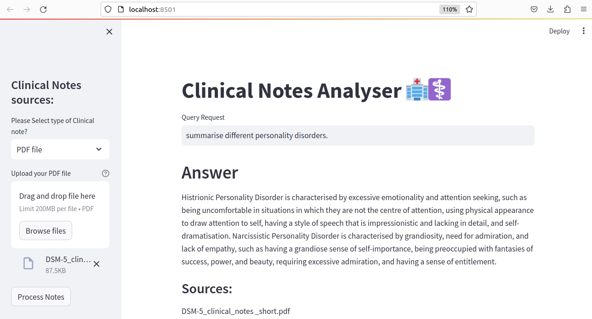

# Clinical Notes Analyser: Question and Answer System Based on Open AI LLM, Biobert fine-tuned model and Langchain for Healthcare company  

This is an end to end LLM project based on OpenAI, Biobert and Langchain. We are building clinical notes analyser for health care domain data. This tool takes the clinical notes from the user and helps to identify the disease and chemical mntioned in the clinical note. It also helped with the query search within the text and helps to summarise the note.



### Project Highlights

- Use any kind of text data stored in text/plain file or PDF file or directly from Webpage.
- Their human staff will use this file to assist their patients.
- We will build an LLM based clinical notes analyser that can reduce the workload of their human staff.
- Patients should be able to use this system to identify the chemicals, and disese mentioned and can ask questions related to notes and get answers within seconds

### Tools and Pre-trained models used:
  - Langchain + OpenAI: LLM based Q&A
  - Biobert: NER for healthcare data
  - Streamlit: UI
  - Huggingface Medical NER embeddings: Text embeddings
  - OpenAI Embeddings: Text embeddings
  - FAISS: Vector databse

### Installation

1.Unzip the poject folder to your local machine using:

2.Navigate to the project directory:

```bash
  cd POC_Clinical_notes_analyser
```
3. Install the required dependencies using pip:

```bash
  pip install -r requirements.txt
```
4.Acquire an api key through OpenAI website and put it in .env file

```bash
  OPENAI_API_KEY="your_api_key_here"
```
### Usage

1. Run the Streamlit app by executing:
```bash
streamlit run main_poc.py

```

2. The web app will open in your browser.

- Enter the clinical note,choose the type of file, Browse the file stored in the disk. make sure the input file is in same root directory as that of main_poc file.

- Click on Process Notes button. It will take some time before medical entities are displayed on the screen.

- Once Entities are shown, embedding vector will be created. you will see a directory called faiss_index in your current folder

- Now you are ready to Search your query. Type your question in Question box and hit Enter

### Sample Questions
  1. Input file: example.txt
  - which genetics conditions lead to increase in risk of autism?
  - Summaries the medical report.
  2. DSM-5_clinical_notes _short.pdf
  - How Other personality disorders is different from histrionic personality disorder?
  - Please tell me about the essential feature of personality disorders.
  - Summarise different personality disorders.

### Project Structure

- main_poc.py: The main Streamlit application script.
- inference.py: This file used to generate NER for medical docs using Biobert model fine-tuned on bc5cdr dataset
- requirements.txt: A list of required Python packages for the project.
- .env: Configuration file for storing your Google API key.

## Solving Medical NER using BioBert( Bert pretrained on Clinical data)

This repository contains fine-tuning of Biobert[https://arxiv.org/abs/1901.08746].Notion of BioBert is pre-training a Bert model on Biomedical data. BioBert is trained on PubMed data(4.5B words) and PubMed Central data(13.5B words) along with English wikipedia and Book Corpus(Original Bert dataset)

### Experimental Setup

1. Pre-trained model:
- BioBert,a pre-trained biomedical representation model for language mining.
- We've used BioBERT v1.1 model for our Named Entity recognition task.
- BioBERT v1.1 refers to pre-trained on PubMed for 1 million steps
- To use BioBERT v1.1, download the [model](https://github.com/naver/biobert-pretrained/releases/tag/v1.1-pubmed).
- Make it compatible with pytorch using **convert_to_pytorch_wt.ipynb** script present in the root directory.


2. Dataset:

- We have used [BC5CDR](https://github.com/cambridgeltl/MTL-Bioinformatics-2016/tree/master/data/BC5CDR-IOB) data for NER.

- About BC5DR, this corpus consists of 1500 PubMed articles with 4409 annotated chemicals, 5818 diseases and 3116 chemical-disease interactions. 

BC5CDR tags :- 
```
    'B-Chemical', 
    'O', 
    'B-Disease', 
    'I-Disease', 
    'I-Chemical'
```

3. Fine-tuning steps:
- Download the pre-trained weights and keep it in **weights** folder.
- Run the **convert_to_pytorch_wt.ipynb** script, It'll generate the pytorch weights.
- Download the datset and keep it in **data** directory.
- Update the necessary parameters in **parameters.py** script.
- Hyperparameters can be changed in **data_load.py**
- To initiate the training run **train.py** script.
- It'll generate the checkpoints per epoch and will save the model in **checkpoints** directory.
4. Inference Steps:
- For inferencing provide the **BC5DR_weights** value in **parameters.py** script from Saved models.
- Run the **inference.py** it'll take user from input and It'll generate the desired Entities with tags Disease and Chemicals.
 

 ### Results:
 - After fine-tuning BC5DR NER data with BioBert model results were as follows:
    - f1=0.96
    - precision=0.95
    - recall=0.96
